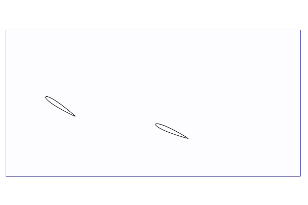

# ParametricBodies

Tutorial video [](https://www.youtube.com/watch?v=6PmJJKVOfvc)


This package to enable working with parametrically defined shapes in [WaterLily](https://github.com/WaterLily-jl/WaterLily.jl). You can add this package via the Julia package manager
```
] add ParametricBodies
using ParametricBodies
```

A `ParametricBody` is a subtype of  `WaterLily.AbstractBody`, defining the `measure(body,x,t)` function needed to run WaterLily simulations.

### Parametric Bodies

A `ParametricBody` is defined using a parametric function repsentation of that shape. For example, a circle can be defined as
```julia
using StaticArrays
curve(θ,t) = SA[cos(θ),sin(θ)]
locate(x::SVector{2},t) = atan(x[2],x[1])
body = ParametricBody(curve,locate)
```
The parametric `curve` function defines the boundary of the circle, and the `locate` function is a general inverse of `curve`: locating the value of the parameter `θ` which is closest to point `x` at time `t`. The `body` can now be used inside a 2D WaterLily simulation. 

A few important features to note: 

**First**, the parametric curve should _always return an `SVector`!_ Returning an array will allocate and won't run on GPUs. 

**Second**, a 2D curve can either define the _boundary_ of a closed body, or it can define a space-curve body with some finite thickness. The default properties are `boundary=true` and `thk=0`, but you can change this by supplying additional arguments. For example, we could model a thin wing section defined by a circular-arc as
```julia
curve(θ,t) = SA[cos(θ),sin(θ)]
locate(x::SVector{2},t) = clamp(atan(x[2],x[1]),π/3,2π/3)
arc = ParametricBody(curve,locate,thk=0.1,boundary=false)
```
A 3D curve can't define the boundary of a 3D volume (that would require a surface, not a curve). We will discuss ways of creating 3D bodies below.

**Third**, the functions `curve` and especially `locate` can be tricky to define for general curves. The next few sections discuss methods to simplify and automate the construction of these functions. 

### Hashed Locator & Body

A `HashedLocator` struct has been defined to automate locating the closest point on a supplied 2D curve. 
```julia
curve(θ,t) = SA[cos(θ),sin(θ)]
lims = (0.,2π) # limits of the parametric function
locator = HashedLocator(curve,lims,step=0.25)
body = ParametricBody(curve,locate)
```
or the convience constructor
```julia
body = HashedBody(curve,(0.,2π),step=0.25)
```
This locator function samples the curve over the supplied parametric limits and uses a Newton root finding method to locate the parameter value. A 2D array of parameter data (a hash table) is used to supply a good initial guess to the Newton solver. 

Note that a `HashedLocator` knows nothing about the details of the `curve`, and you must test it's accuracy before using it in a WaterLily simulation. Also, the hash must be updated if the curve is time-varying, and must be stored in a GPU array when computing on the GPU. See the example folder. The `HashedLocator` is currently only available for 2D curves, although it can be used with mapping and `PlanarBodies`, to define bodies for 3D simulations, see below.

### NurbsCurve & Locator

A NURBS (Non-Uniform Rational B-Spline) based `NurbsCurve` struct make both the definition and location process more simple, and extends to 3D space-curves. For example, given a matrix of 2D points `pnts` along a desired curve, we can define a body easily
```julia
pnts = SA[0. 3. -1. -4  -4.
          0. 4.  4.  0. -3.]
nurbs = interpNurbs(pnts;p=3) # fit a cubic NurbsCurve through the points
body = ParametricBody(nurbs)
```
An efficient and accurate `NurbsLocator` is created automatically for `NurbsCurve`s. However, it is not as fast as a `HashedLocator`. If speed is a limiting factor, you can always use `body = HashedBody(nurbs,(0,1))` to create a fast locator, although it may not be as accurate.

You can also create a NURBS by supplying the control points, knots and weights directly. For example, the code below defines a 3D torus using a NURBS to describe the major circle of radius 7, and thickening the space-curve with a minor radius of 1.
```julia
cps = SA_32[7 7 0 -7 -7 -7  0  7 7
            0 7 7  7  0 -7 -7 -7 0
            0 0 0  0  0  0  0  0 0] # a (planar) 3D circle
weights = SA_32[1.,√2/2,1.,√2/2,1.,√2/2,1.,√2/2,1.] # A perfect circle requires...
knots = SA_32[0,0,0,1/4,1/4,1/2,1/2,3/4,3/4,1,1,1]  # non-uniform knot and weight vectors
circle = NurbsCurve(cps,knots,weights)
torus = ParametricBody(circle,thk=2,boundary=false)
```

### Mappings & 3D surfaces

Like `WaterLily.AutoBodies`, the utility of `ParametricBodies` is greatly increased through an optional `map` function. 

Primarily, mapping can be used to move, rotate and scale the body in the simulation. For example, let's place the arc-wing above in a simulation:
```julia
using WaterLily
function arc_sim(R = 64, α = π/16, U=1, Re=100)
    curve(θ,t) = SA[cos(θ),sin(θ)] # ξ-space: angle=0,center=0,radius=1
    Rotate = SA[cos(α) -sin(α); sin(α) cos(α)]
    center = SA[R,-2R÷5]
    scale = R
    map(x,t) = Rotate*(x-center)/scale # map from x-space to ξ-space
    arc = HashedBody(curve,(π/3,2π/3),thk=√2+2,boundary=false,map=map)
    Simulation((3R,R),(U,0),R,body=arc,ν=U*R/Re)
end
sim = arc_sim();
```
See the WaterLily repo and the video above for more discussion of this primary use of the map function. 

A secondary application of the mapping function for `ParametricBodies` is to map from a 3D x-space to a 2D ξ-space, effectively extruding a 2D parametric curve into a 3D surface. For example, we can make a cylinder or sphere starting from a 2D NURBS circle using
```julia
# Make a cylinder
map(x::SVector{3},t) = SA[x[2],x[3]] # extrude along x[1]-axis
cylinder = ParametricBody(circle;map,scale=1f0)

# Make a sphere
map(x::SVector{3},t) = SA[x[1],√(x[2]^2+x[3]^2)] # revolve around x[1]-axis
sphere = ParametricBody(circle;map,scale=1f0)
```
and if we started from, say, a NACA profile, the same technique could make a uniform 3D wing or a 3D air-ship hull. Note that the `scale` argument must be explicitly supplied since the determinant of this mixed dimensional `map` isn't defined. 

A mapping is not sufficient to make 3D planar geometries, so a simple wrapper struct `PlanarBody` is defined for this purpose. For example, a circular disk can be created using
```julia
disk = PlanarBody(circle;map=(x,t)->SA[2x[2],2x[3],2x[1]])
```
where the mapping has been used to scale and rotate the disk as well.

### Dynamic Bodies

`ParametricBodies` have two ways to be dynamic: 
1. A time-varying parametric curve
2. A time-varying map

and these methods can be used together, as demonstrated in the example folder. There are many examples of time varying mappings in the WaterLily repo and the video above, so we'll focus on time-varying curves here. 

If `curve` depends explicitly on `t`, this will automatically be reflected in the position and velocity of the body in a simulation. For example, a spinning circle is easily acheived using
```julia
curve(θ,t) = SA[cos(θ+t),sin(θ+t)]
locate(x::SVector{2},t) = atan(x[2],x[1])-t
spinning_body = ParametricBody(curve,locate)
```
If you are using a `HashedLocator` for a dynamic curve you will need to call `update!(body,t)` frequently (probably every time step of the simulation) so that the initial guess of the locator reflects the correct position of the body.

We supply a special function `DynamicNurbsBody` for dynamics NURBS which defines a second spline for the velocity. This function also requires calling `update!(body,...)`, but in this case, the control points for both the position and velocity are updated. Here's an example
```julia
body = DynamicNurbsBody(circle)
dt,dx = 0.1,0.1                  # time step and uniform displacement
new_pnts = circle.pnts .+ dx     # define updated control points
body = update!(body,new_pnts,Δt) # new body will have unit velocity (dx/dt=1)
```

### Examples

We provide some simple examples in the `examples` folder.

- [The flow around a 2D circle defined from a NURBS curve.](example/TwoD_Circle.jl) 
- [The flow around a 2D arc](example/TwoD_Arc.jl)
- [The flow around a 2D ellipse defined by its parametric equation](example/TwoD_Ellipse.jl)
- [The flow around a 2D general NURBS with time-varying control points](example/TwoD_NURBS.jl)
- [The flow around a 3D general NURBS with time-varying control points](example/ThreeD_NURBS.jl)
- [The flow around a vertical axis wind turbine blade in a spanwise periodic domain](example/ThreeD_RotatingBladeSpanperiodic.jl)


